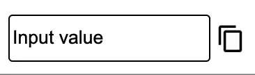

# Copy To Clipboard
Adds a copy button next to your HTML element. When clicking the icon, the value of the element is copied to the clipboard and a *Copied* overlay is displayed for a short duration. Works with `<input>`, `<textarea>`, ``, and `
` elements\

## Usage instructions
* Load the copyToClipboard.js in the footer of your HTML\
``
* Add the data-copy attribute to your desired elements\
`<input type="text" value="MyValue" data-copy>`

## Icon colors
To change the icons to white, add the *light-icons* attribute to the element\
`<input type="text" value="MyValue" data-copy light-icons>`
